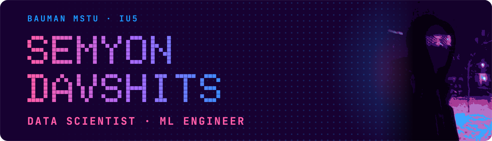
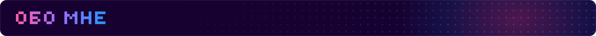
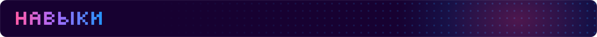
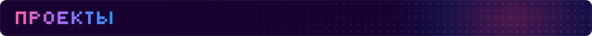
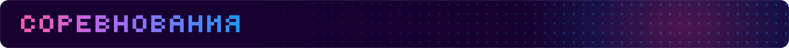
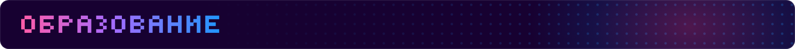
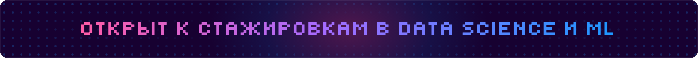

  
  

&nbsp;
&nbsp;

Студент 4 курса МГТУ им. Н. Э. Баумана, кафедра ИУ5, выпуск 2027.
Строю модели на табличных данных и временных рядах, занимаюсь uplift-моделированием и статистикой
экспериментов, а также computer vision и аудио. Довожу модели до сервиса с API, тестами и Docker.

| Область | Стек |
|---|---|
| **ML и табличные данные** |              |
| **DL · CV · аудио** |          |
| **LLM · NLP** |       |
| **Данные · инфраструктура** |           |

**[X5 RetailHero Uplift](https://github.com/SeMe4K-0/X5-retailhero-uplift)** · кому рассылка реально меняет поведение &nbsp;
> Uplift-моделирование на 45.8 млн строк чеков в PostgreSQL (dbt, 42 теста). T/S/X-learner на CatBoost и метрики причинности (Qini, AUUC, uplift@k) написаны без готовых библиотек. Топ-10 % по отклику и топ-10 % по приросту пересекаются всего на **0.44 %** при случайном уровне 10 %; **Δ uplift@10 % = +9.53 п.п.** [+6.63; +12.54], бутстрап 2000 реплик. Таргетинг по отклику убыточен (0.53 п.п. при точке окупаемости 4.67), а таргетинг по приросту даёт **+612 тыс. ₽** на кампанию. План эксперимента зафиксирован до первой модели, аудитор утечек проверен мутационным тестом.

**[E-CUP 2026 (Ozon)](https://github.com/SeMe4K-0/Ozon-ecup-2026-user-ltv)** · прогноз GMV 250 000 пользователей на 30 дней · команда из 2 &nbsp;
> **14 место из 316**, приватный RMSLE **1.6631**. Каждая обучающая строка - пара «пользователь и дата» с признаками строго до этой даты, обучение прямо в шкале метрики (log1p), итоговая модель - ансамбль GRU и градиентного бустинга. Классификатор «обучение против теста» нашёл утечку даты якоря (AUC 1.0); после её удаления стало видно, что 93 % локального прироста были ложными.

**[OreScope](https://github.com/SeMe4K-0/OreScope)** · сорт руды по микроскопии шлифов · финалист Норникель AI Science Hack &nbsp;
> Сегментация фаз U-Net на панорамах до 300 Мп, сорт выносится экспертным правилом по маске. **macro-F1 0.91** по типу срастаний, **0.77** end-to-end. Нормализация цвета подняла распознавание на новом домене с 5 до 14 проб из 20 без новой разметки. Панорама обрабатывается за 124 с при нормативе 5 минут; FastAPI, Docker, 48 часов.

**[Stem Separator](https://github.com/SeMe4K-0/Stem-separator)** · разделение трека на 4 дорожки &nbsp;
> Demucs (htdemucs) за REST API, веб-интерфейсом и CLI. **SDR 9.34 dB** на вокале и **9.90 dB** на басе (museval, MUSDB18-sample, 5 треков). Трек 3:17 разделяется за **14 с** на M4 Pro (×14 быстрее реального времени). Автовыбор MPS/CUDA/CPU, обработка кусками, 19 тестов, Docker Compose.

**[FAD Benchmark](https://github.com/SeMe4K-0/Music-generation-fad-benchmark)** · оценка генеративных моделей музыки · НИР МГТУ &nbsp;
> Пять open-source моделей генерации музыки по тексту (MusicGen, AudioLDM-M/L, MusicLDM, Riffusion) сравниваются по FAD, **FAD-inf**, per-song FAD и CLAP Score, с тремя эмбеддерами (CLAP-LAION-Music, MERT-v1-95M, EnCodec) и двумя референсами. Лидер зависит от референса: **AudioLDM-M** на FMA-Pop (CLAP-FAD 0.039), **MusicLDM** на MTG-Jamendo (0.0044).

**[AI Team Assistant](https://github.com/SeMe4K-0/Ai-team-assistant)** · LLM-ассистент со строгим форматом ответа &nbsp;
> Google Gemini через серверный роут, structured output через `responseSchema`, поэтому JSON валиден по построению. Prompt-evals прогоняют 4 синтетических запроса, включая prompt-injection, и проверяют структуру и содержательные инварианты.

**[Smoking Detection](https://github.com/SeMe4K-0/Smoking-detection-yolo-coreml)** · детекция курения по видеопотоку на устройстве &nbsp;
> YOLO26n на классах person / smoke: **mAP50 0.713**, mAP50-95 0.317, precision 0.744, recall 0.680. Факт курения фиксируется по пересечению рамок, модель экспортирована в CoreML (.mlpackage) для инференса на iOS.

| Год | Соревнование | Результат | Ссылка |
|---|---|---|---|
| 2026 | **E-CUP 2026 (Ozon)**: прогноз GMV пользователей на 30 дней · команда O3 |  RMSLE 1.6631 | [решение](https://github.com/SeMe4K-0/Ozon-ecup-2026-user-ltv) |
| 2026 | **Yandex ML Challenge** (Young & Yandex), финал |  | [сертификат](certificates/2026-yandex-ml-challenge-42.pdf) |
| 2026 | **ШАД Яндекса**: интенсив AI Agents Security Week |  guardrail, старт 61.54 · red team 71.43 / 100 | [сертификат](certificates/2026-shad-ai-agents-security-week.pdf) |
| 2026 | **Хакатон DatsSol** (DatsTeam): бот управления колонией |  | [решение](https://github.com/SeMe4K-0/Hackathon_DatsTeam) |
| 2026 | **Норникель AI Science Hack**: классификация руд по микроскопии |  macro-F1 0.91 | [решение](https://github.com/SeMe4K-0/OreScope) |

| Учебное заведение | Программа | Год |
|---|---|---|
| **МГТУ им. Н. Э. Баумана** | Бакалавриат, 09.03.01 «Информатика и вычислительная техника», кафедра ИУ5 | 4 курс, выпуск 2027 |

